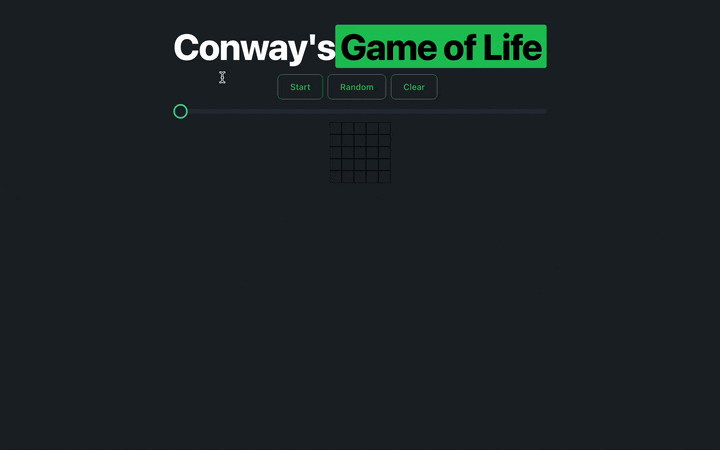

# Conway's Game of Life (ft. React.js)

Built with `Typescript`, using `React.js` and `Tailwind CSS`.

### Demo

### Available Commands

In the project directory, you can run:

#### `npm start`

Runs the app in the development mode.\
Opens on [http://localhost:3000](http://localhost:3000).

#### `npm run build`

Builds the app for production to the `build` folder.
